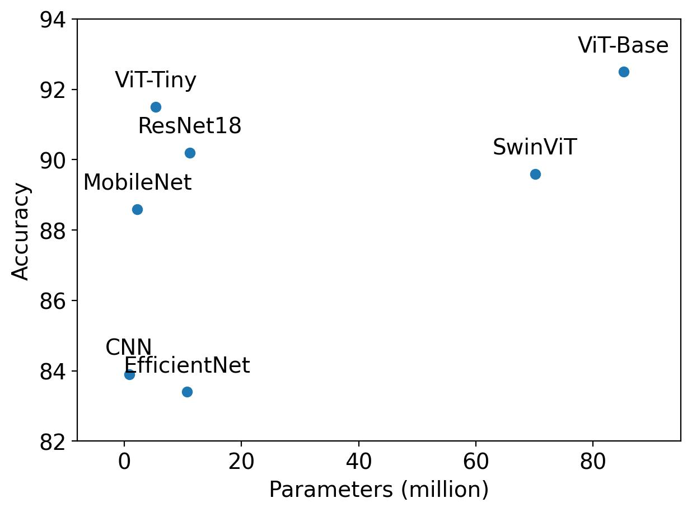
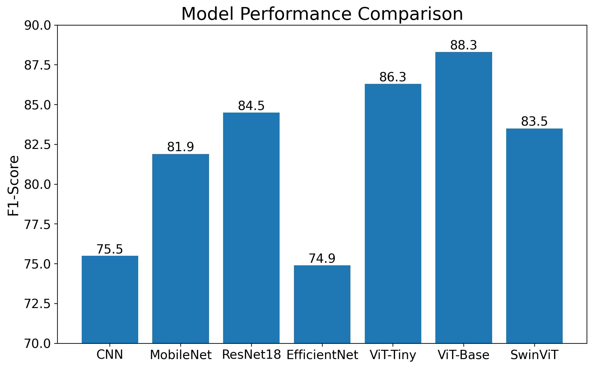

# VLASS-Vision

Vision model for VLASS images

| Model | Accuracy | F1-score | Pretrained | Frozen | Parameters | Augmentation |
|:--:|:--:|:--:|:--:|:--:|:--:|:--:|
| CNN | 83.9 | 75.5 | False | False | 867K | No |
| CNN | 83.9 | 75.5 | False | False | 867K | Yes |
| Resnet18 | 73.8 | 60.1 | True | True | 11.2M | No |
| ResNet18 | 88.1 | 81.4 | True | False | 11.2M | No | 
| ResNet18 | 90.2 | 84.5 | True | False | 11.2M | Yes |
| MobileNet | 88.6 | 81.9 | True | False | 2.2M | Yes |
| EfficientNet | 83.4 | 74.9 | True | False | 10.7M | Yes | 
| ViT-Tiny | 84.0 | 73.3 | True | True | 5.4M | No |
| ViT-Tiny | 91.5 | 86.9 | True | False | 5.4M | No |
| ViT-Small | 91.7 | 87.5 | True | False | 21.3M | Yes |
| ViT-Base | 91.9 | 87.9 | True | False | 85.2M | No |
| ViT-Base | 92.5 | 88.3 | True | False | 85.2M | Yes |
| SwinViT | 89.3 | 83.1 | True | False | 70.1M | No |
| SwinViT | 89.6 | 83.5 | True | False | 70.1M | Yes |
<!-- | ViT-Tiny | 92.5 | 88.3 | True | False | 5.4M | Yes | -->

## Sample Image


## Reproduce

To train a model use the `trainer.py` script with appropriate configuration. For example, the following runs the vision transformer model. Use the `srun` before python command if running in a slurm environment with distributed training. You can change the yaml file for different configurations or create a new one and update the command bellow.

```bash
python trainer.py fit --config configs/vit.yaml
```

## Results

### Accuracy




### F1-Score




## Interpretation

Interpreting the vision transformer model.

### Integrated Gradients

Local interpretation method allows generic explainable framework only focusing on the input and how important each pixed to the output.


### Self-Attention Weights

Softmax self-attention weights averaged over the multi-attention heads. The red regions show where attention was most focused on. This shows high-dimentional features learnt by the model.

